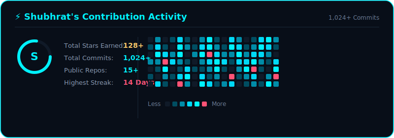

<picture>
  <source media="(prefers-color-scheme: dark)" srcset="./banner.svg?v=1">
  <source media="(prefers-color-scheme: light)" srcset="./banner-light.svg?v=1">
  
</picture>

 

### Hi there, I'm Shubhrat! 👋

  
  

  

### 🐍 My Contribution Graph

  

---

<!-- ⚡ CONNECT WITH ME SECTION ⚡ -->

  

    

  <!-- Fully Working Interactive Buttons -->
  
  &nbsp;
  
  &nbsp;
  
  &nbsp;
  
  &nbsp;
  

